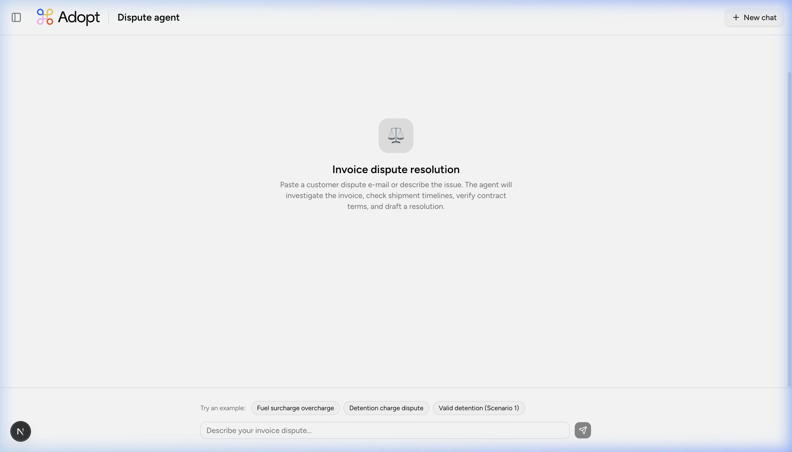
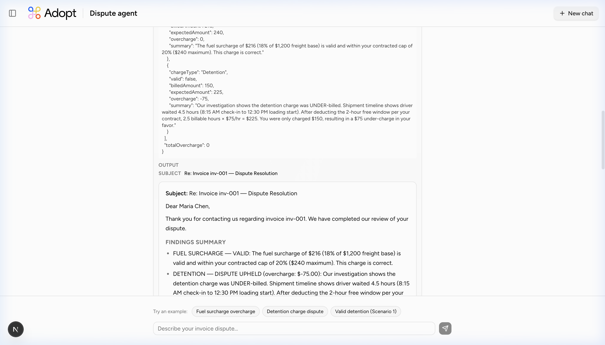

<p align="center">
  
</p>

# Invoice dispute resolution agent

An AI-powered agent that automates freight invoice dispute resolution for logistics companies. Paste a customer dispute email, and the agent systematically investigates the invoice, checks shipment timelines, verifies contract terms, validates each charge, drafts a professional response email, and updates the CRM — all in under a minute.

Built with **Next.js 16**, the **Vercel AI SDK**, and **Claude Sonnet 4.5**.

---

## Features

- **End-to-end dispute resolution** — from email intake to drafted response in one conversation
- **Agentic tool use** — the AI autonomously calls the right tools in the right order based on the dispute
- **Charge validation engine** — detention, fuel surcharge, liftgate, and residential delivery charge verification against contract terms and shipment data
- **Professional email drafting** — generates ready-to-send dispute response emails with findings summary
- **CRM integration** — automatically creates resolution notes and updates case status
- **Multi-session support** — sidebar with chat history for managing multiple active disputes
- **Example scenarios** — one-click example disputes to demonstrate the agent's capabilities

---

## Architecture

```
┌─────────────────────────────────────────────────────────┐
│                        Front-end                        │
│  Next.js 16 · React 19 · TailwindCSS v4 · shadcn/ui     │
│                                                         │
│  ┌──────────┐  ┌──────────────┐  ┌───────────────────┐  │
│  │ Chat UI  │  │  Tool call   │  │  Markdown / Email │  │
│  │          │  │  renderer    │  │  renderer         │  │
│  └──────────┘  └──────────────┘  └───────────────────┘  │
└───────────────────────┬─────────────────────────────────┘
                        │ useChat (AI SDK)
                        ▼
┌─────────────────────────────────────────────────────────┐
│                    API route                            │
│  POST /api/chat · streamText · Claude Sonnet 4.5        │
└───────────────────────┬─────────────────────────────────┘
                        │ Tool calls (agentic loop)
                        ▼
┌─────────────────────────────────────────────────────────┐
│                   Agent tools                           │
│                                                         │
│  lookupInvoice        → Invoice & line item lookup      │
│  getShipmentTimeline  → Shipment events & timestamps    │
│  checkContractTerms   → Customer contract terms         │
│  validateCharge       → Charge correctness validation   │
│  draftResponseEmail   → Professional email generation   │
│  updateCrmCase        → CRM case status update          │
└───────────────────────┬─────────────────────────────────┘
                        │
                        ▼
┌─────────────────────────────────────────────────────────┐
│                  Seed data layer                        │
│  In-memory datasets: invoices, shipments, contracts,    │
│  customers, CRM cases                                   │
└─────────────────────────────────────────────────────────┘
```

### Agent workflow

When a dispute is submitted, the agent follows this process:

1. **Parse** — Identifies the customer, invoice number, and disputed charges from the message
2. **Investigate** — Pulls the invoice, shipment timeline, and contract terms using tool calls
3. **Validate** — Runs each disputed charge through the validation engine, comparing billed amounts against contract terms and shipment data
4. **Resolve** — Summarizes findings, calculates any credit due, and drafts a professional response email
5. **Record** — Updates the CRM case with the resolution

<p align="center">
  
</p>

---

## Getting started

### Prerequisites

- **Node.js** 18.17 or later
- An **Anthropic API key** ([get one here](https://console.anthropic.com/))

### Installation

```bash
# Clone the repository
git clone https://github.com/thiago-ss/dispute-agent.git
cd dispute-agent

# Install dependencies
npm install

# Set up environment variables
cp .env.local.example .env.local
```

Add your Anthropic API key to `.env.local`:

```env
ANTHROPIC_API_KEY=sk-ant-...
```

### Running locally

```bash
npm run dev
```

Open [http://localhost:3000](http://localhost:3000) — try one of the example dispute scenarios or paste your own.

---

## Tech stack

| Layer      | Technology                                                                                                   |
| ---------- | ------------------------------------------------------------------------------------------------------------ |
| Framework  | [Next.js 16](https://nextjs.org) (App Router)                                                                |
| UI         | [React 19](https://react.dev), [shadcn/ui](https://ui.shadcn.com), [Tailwind CSS 4](https://tailwindcss.com) |
| AI         | [Vercel AI SDK](https://ai-sdk.dev), [Claude Sonnet 4.5](https://www.anthropic.com)                          |
| Validation | [Zod](https://zod.dev) (tool input schemas)                                                                  |
| Icons      | [Lucide React](https://lucide.dev)                                                                           |
| Deployment | [Vercel](https://vercel.com)                                                                                 |

---

## Project structure

```
dispute-agent/
├── app/
│   ├── api/chat/route.ts     # AI chat endpoint (Claude + tools)
│   ├── layout.tsx             # Root layout (Figtree font, metadata)
│   ├── page.tsx               # Main chat interface with multi-session
│   └── globals.css            # Design tokens & global styles
├── components/
│   ├── chat-message.tsx       # Message bubble renderer
│   ├── dispute-input.tsx      # Input bar with example dispute chips
│   ├── header.tsx             # App header with sidebar toggle
│   ├── markdown-renderer.tsx  # Rich markdown rendering for responses
│   ├── sidebar.tsx            # Chat session sidebar (Sheet-based)
│   ├── tool-call.tsx          # Collapsible tool call result display
│   └── ui/                    # shadcn/ui primitives
├── lib/
│   ├── tools.ts               # 6 agent tools (invoice, shipment, etc.)
│   ├── utils.ts               # Shared utilities
│   └── data/                  # Seed datasets
│       ├── invoices.ts        # Sample invoices with line items
│       ├── shipments.ts       # Shipment timelines with events
│       ├── contracts.ts       # Customer contract terms
│       ├── customers.ts       # Customer directory
│       └── cases.ts           # CRM case records
├── docs/
│   └── poc-plan.md            # Phase 2+ production rollout plan
├── vercel.json                # Function config (60s timeout)
└── package.json
```

---

## Agent tools

| Tool                  | Purpose                                                                                      |
| --------------------- | -------------------------------------------------------------------------------------------- |
| `lookupInvoice`       | Retrieves invoice details and line items by invoice ID or customer name                      |
| `getShipmentTimeline` | Pulls timestamped shipment events (arrival, loading, departure) for detention validation     |
| `checkContractTerms`  | Fetches the customer's contracted rates — fuel caps, detention windows, accessorial rates    |
| `validateCharge`      | Validates a specific charge against shipment data and contract terms; calculates overcharges |
| `draftResponseEmail`  | Generates a professional dispute response email with findings and resolution                 |
| `updateCrmCase`       | Updates the CRM case status and adds a resolution note                                       |

---

## Example scenarios

The app ships with three built-in scenarios you can try:

| Scenario                      | What happens                                                                                                                               |
| ----------------------------- | ------------------------------------------------------------------------------------------------------------------------------------------ |
| **Fuel surcharge overcharge** | Customer was billed 24% fuel surcharge, contract caps at 20%. Agent identifies the overcharge and calculates the credit.                   |
| **Detention charge dispute**  | Detention charge billed but driver was within the free window. Agent validates using shipment timeline and confirms the charge is invalid. |
| **Valid detention**           | Customer disputes a detention charge that is actually correct. Agent explains why the charge stands using timeline and contract data.      |
